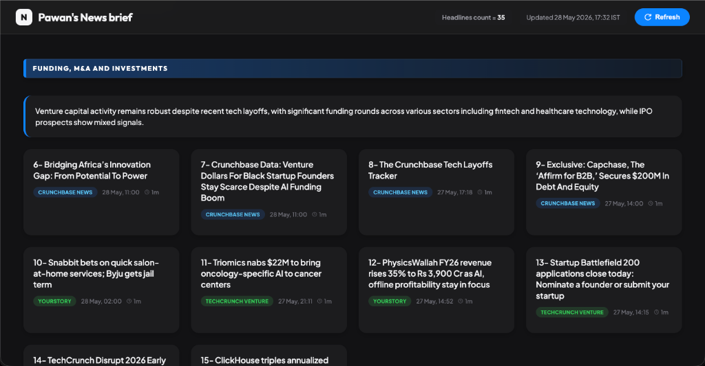

# No-YouTube News Dash

> I was spending 2 hours a day on YouTube just to stay informed.
> I built a system that replaced all of it with a 5-minute morning briefing.
> It cost 8 cents to build. It runs itself every single day.

---



---

## Does This Sound Familiar?

You open YouTube to check one thing — a development in the Middle East, the latest AI model release, what is happening with India's foreign policy.

Forty minutes later you are watching something completely unrelated. You close the app feeling vaguely guilty and somehow less informed than when you started.

This is not a willpower problem. This is not a discipline problem.

**This is an engineering problem.**

YouTube's algorithm is not designed to inform you. It is designed to keep you watching. Those are opposite goals. And the algorithm is very, very good at its job.

The only way to win is to stop playing the game entirely.

---

## The Insight That Changed Everything

I didn't need less news. I needed news delivered differently.

What I actually wanted was simple:

- Tell me what happened today in geopolitics, AI, and technology
- Tell me which sources are saying it
- Give me a two-sentence summary of each story
- Deliver it before I wake up
- Never ask me to scroll, click, or choose what to watch next

That's not a news app. That's an intelligence briefing. The kind a CEO gets from their chief of staff every morning.

So I built one. For myself. Automatically. Using AI.

---

## What I Built

**No-YouTube News Dash** is a personal intelligence system that runs silently on my Mac.

Every morning at 7 AM and every evening at 7 PM, it:

1. Reads 40+ authoritative news sources across geopolitics, AI, and technology
2. Removes duplicate stories (the same news reported by 10 outlets becomes 1 card)
3. Uses AI to write a 2-sentence summary of every article
4. Analyzes the day's geopolitical news and identifies which market sectors will benefit or suffer
5. Scrapes GitHub for the most exciting new open-source projects
6. Delivers everything as a clean, structured briefing — either on a local dashboard or via email

No thumbnails. No autoplay. No algorithm deciding what you see next.

Just the information. Organized. Summarized. Delivered.

---

## The Result

**Before:** 2 hours on YouTube, fragmented attention, low signal, high guilt.

**After:** 5 minutes reading a briefing over morning coffee, complete picture of everything that matters, full day of focused attention intact.

I no longer open YouTube to stay informed. The need it was serving is already met before I wake up.

---

## How It Works — In Plain English

You do not need to be a developer to understand this. Here is exactly what happens:

### Step 1 — It Reads the Sources
Every hour, the system checks 40+ news sources — Foreign Affairs for geopolitics, MIT Technology Review for AI, Ars Technica for tech, Observer Research Foundation for India-specific analysis, and many more. These are not random websites. They are hand-picked, authority-ranked sources. The same ones analysts and policymakers actually read.

### Step 2 — It Removes the Noise
Reuters, Bloomberg, The Hindu, and The Print will all report the same story. The system detects this and keeps only one version — from the most authoritative source. You read the story once, not four times.

### Step 3 — It Reads Every Article So You Don't Have To
An AI reads each article and writes exactly two sentences. What happened. Who is involved. Why it matters. Nothing else.

### Step 4 — It Thinks About What It All Means
Once a day, the system looks at all the geopolitical news together and asks: given everything that happened today, which industries will benefit? Which will face pressure? It generates a structured analysis — not a prediction, but a reasoned inference from the day's actual events.

### Step 5 — It Delivers and Disappears
The briefing lands in your inbox or on a local webpage. You read it in 5 minutes. The system goes back to sleep until the next cycle. It never asks for your attention again.

---

## Why This Approach Is Different

Most news apps solve the wrong problem. They give you more content, better organized. More things to scroll through. More notifications.

This system solves the right problem. It **eliminates the behavior** that was wasting your time, by making the underlying need — staying informed — cheaper to satisfy than opening YouTube.

You cannot scroll through this briefing. There is no autoplay. There is no algorithm learning what keeps you engaged. There is no comments section. There is no "watch next."

There is only today's intelligence. Read it, close it, go live your life.

---

## The Sources — Why They Matter

The system does not scrape random websites. Every source was manually selected and ranked by authority.

**For Geopolitics:**
Foreign Affairs, Foreign Policy, CSIS, Geopolitical Futures, The Economist, Reuters, Bloomberg — for global developments. Observer Research Foundation, Carnegie India, Takshashila Institution, The Hindu, The Print — for India-specific strategic analysis.

**For Artificial Intelligence:**
MIT Technology Review, Import AI (Jack Clark, one of the founders of OpenAI), The Batch (Andrew Ng), Anthropic Blog, OpenAI Blog, Google DeepMind Blog, Nature Machine Intelligence, IEEE Spectrum — for research and industry developments. Harvard Business Review, McKinsey, BCG — for business impact. Stanford HAI, World Economic Forum, Brookings — for labor market effects.

**For Technology:**
Ars Technica, The Register, IEEE Spectrum, InfoQ, The New Stack, Hacker News — for industry news. GitHub Trending — for the open-source pulse. Crunchbase, TechCrunch, Inc42, YourStory, Entrackr — for funding and acquisitions including India-specific deal flow.

Forty-plus sources. Curated by hand. Tiered by authority. Updated by machine.

---

## What It Cost to Build

This is the part that still surprises me.

**Time to build:** 2 hours  
**API cost:** $0.08 (eight US cents)  
**Daily running cost:** Effectively zero  
**Daily time saved:** 90-120 minutes

The entire system was designed and built in a single late-night session using AI as a coding and thinking partner. Not vibe coding — systematic, planned, documented engineering. But compressed from what would have been 5-6 weeks of manual developer work into a single evening.

This is what AI-accelerated development actually looks like in 2026. Not magic. Not hype. A motivated person, a clear problem, and the right tools.

---

## Can You Build This For Yourself?

Yes. If you can follow instructions and spend 2-3 hours on a weekend, you can have your own version running.

You do not need to be a developer. You need:
- A Mac or Linux computer
- An Anthropic API account (free to create, costs pennies to use)
- The execution document in this repository (it has every command, exactly as you type it, with expected output at every step)

The system is fully configurable without any coding knowledge. Want to add a new news source? Edit one line in a text file. Want to change the delivery time? Edit one number. Want to focus on different topics? Change the keywords list.

Everything is designed to be owned and modified by you, not dependent on any third-party service or subscription.

---

## The Bigger Point

We are living through a moment where the tools to build bespoke, personal technology have become accessible to almost anyone.

For most of human history, if a problem in your daily life had a software solution, you needed to either pay a developer thousands of dollars or spend months learning to code.

That is no longer true.

The barrier between "I have a problem" and "I have a working solution" has collapsed. The only thing left is:

1. Being precise about what problem you actually have
2. Being willing to spend an afternoon building a solution
3. Trusting that the investment of 2-3 hours will return years of reclaimed time

I spent 2 hours building this. In the 4 days since it went live, I have reclaimed roughly 8 hours of attention I would have otherwise lost to algorithmic feeds.

The ROI on that 2-hour investment compounds every single day for as long as I use the system.

---

## Technical Stack (For the Developers)

If you are a developer and want to understand what is under the hood:

- **Language:** Python 3.11+
- **Web Framework:** FastAPI with Jinja2 templating
- **Database:** SQLite via SQLAlchemy (async)
- **Feed Parsing:** feedparser + httpx (async, concurrent)
- **Deduplication:** Two-stage — URL hash matching + semantic similarity via sentence-transformers
- **Classification:** Priority-ordered keyword matching, fully config-driven via YAML
- **Summarisation:** Claude Haiku (Anthropic API) with SQLite caching
- **Derived Analysis:** Claude Sonnet for market sector inference, local Gemma 2B via Ollama as fallback
- **Scheduling:** APScheduler with cron triggers
- **Automation:** macOS launchd daemon (starts on login, restarts on crash)
- **Configuration:** Single YAML file — all sources, topics, keywords, schedules. No code changes needed to add or remove anything.

Full technical documentation, functional specification, and step-by-step execution guide are included in this repository.

---

## Repository Structure

```
no-youtube-news-dash/
├── config/
│   └── sources.yaml          # All sources, topics, keywords — edit this to customise
├── src/newsdash/
│   ├── fetchers/             # RSS and GitHub ingestion
│   ├── pipeline/             # Dedup, classify, summarise, derive
│   ├── server/               # FastAPI dashboard
│   └── digest/               # Email digest
├── docs/
│   ├── 01_TECHNICAL.md       # Full architecture and system design
│   ├── 02_FUNCTIONAL.md      # What it does, in plain English
│   └── 03_EXECUTION.md       # Step-by-step build guide, exact commands
└── launchd/                  # macOS background service config
```

---

## Quick Start

```bash
# 1. Clone the repository
git clone https://github.com/pawantekchandani/no-youtube-news-dash
cd no-youtube-news-dash

# 2. Set up Python environment
uv venv .venv && source .venv/bin/activate
uv pip install -e .

# 3. Add your API key
cp .env.example .env
# Open .env and add your Anthropic API key

# 4. Run the first pipeline cycle
python -m newsdash.pipeline_runner

# 5. Start the dashboard
python -m newsdash
# Open http://localhost:8000
```

For the complete setup guide including email digest configuration and macOS background service installation, see [docs/03_EXECUTION.md](docs/03_EXECUTION.md).

---

## License

MIT — use it, modify it, build your own version. That is the point.

---

*Built in one evening. Running every day. Costs less than a rupee per week.*  
*Your attention is worth more than what the algorithm is paying for it.*
