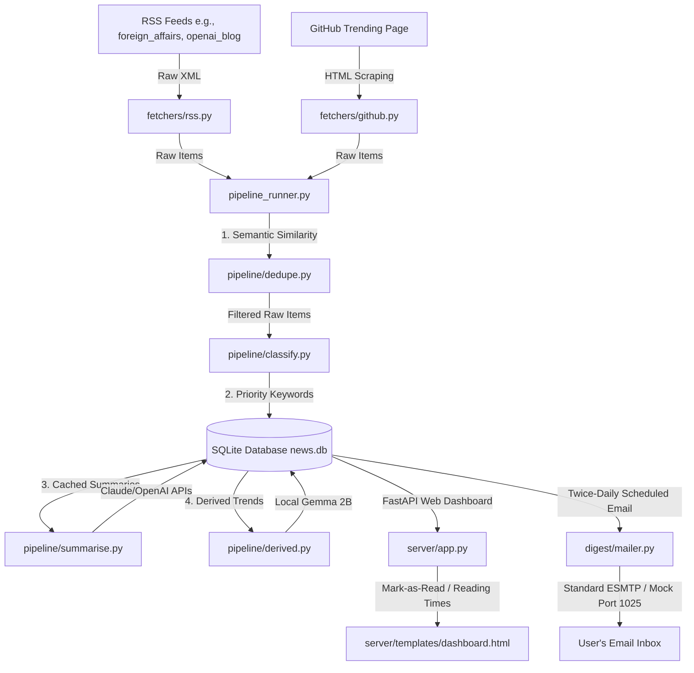

# Comprehensive Walkthrough — Personal Geopolitics & Tech Aggregator

This document provides a comprehensive chronological history and architectural guide of all **five project phases** executed to build the **Personal Geopolitics & Tech Intelligence Aggregator**.

All files are active in your workspace: `/Users/pawan/Coding projects/Pawans personal news app`.

---

## Architectural Map



---

## 1. Phase 1 — Core Working Aggregator

### Goals
Establish a fully functional, local news ingestion pipeline capable of pulling articles, resolving duplicates, classifying topics, and displaying them in a modern web dashboard.

### Core Components Built
* **[NEW] [models.py](file:///Users/pawan/Coding%20projects/Pawans%20personal%20news%20app/src/newsdash/db/models.py)**: Established SQLite schemas via SQLAlchemy including:
  * `raw_items`: Temporary table storing incoming articles.
  * `articles`: Permanent table for deduplicated and categorized articles.
  * `derived_insights`: Table for daily synthesized reports.
  * `pipeline_runs`: Operational telemetry table.
* **[NEW] [rss.py](file:///Users/pawan/Coding%20projects/Pawans%20personal%20news%20app/src/newsdash/fetchers/rss.py)**: Async RSS reader utilizing `httpx` and `feedparser` to ingest raw article fields.
* **[NEW] [github.py](file:///Users/pawan/Coding%20projects/Pawans%20personal%20news%20app/src/newsdash/fetchers/github.py)**: Custom scraper to pull weekly trending repositories across Python, JavaScript, TypeScript, Rust, and Go.
* **[NEW] [classify.py](file:///Users/pawan/Coding%20projects/Pawans%20personal%20news%20app/src/newsdash/pipeline/classify.py)**: Keyword-matching classification engine mapping raw articles to their designated column sections based on keyword lists in `config/sources.yaml`.
* **[NEW] [app.py](file:///Users/pawan/Coding%20projects/Pawans%20personal%20news%20app/src/newsdash/server/app.py)**: FastAPI backend serving dashboard routes and database queries.
* **[NEW] [dashboard.html](file:///Users/pawan/Coding%20projects/Pawans%20personal%20news%20app/src/newsdash/server/templates/dashboard.html)**: High-fidelity, premium glassmorphic web UI dividing headlines into four CSS columns: **Geopolitics**, **AI**, **Tech**, and **Markets**.
* **[NEW] [pipeline_runner.py](file:///Users/pawan/Coding%20projects/Pawans%20personal%20news%20app/src/newsdash/pipeline_runner.py)**: Orchestration script running ingestion, deduplication, and database commits.

---

## 2. Phase 2 — AI Ingestion & Summaries

### Goals
Incorporate large language model (LLM) summaries into fetched articles to deliver rapid, scannable intelligence without opening external URLs.

### Core Components Built
* **[NEW] [summarise.py](file:///Users/pawan/Coding%20projects/Pawans%20personal%20news%20app/src/newsdash/pipeline/summarise.py)**: Integrate Claude (Anthropic API) and GPT (OpenAI API) providers.
  * **Cost Mitigation**: Implemented a caching system that writes summaries to SQLite (`summary_cached = True`) and skips summarization for pre-processed articles to prevent repetitive API charges.
  * **API Resiliency**: The system automatically serves raw description snippets as fallback cards if LLM APIs are unreachable, avoiding application blockages.

---

## 3. Phase 3 — Daily Derived Insights & VC Market Reports

### Goals
Automate the daily synthesis of massive headline listings into high-level intelligence reports: identifying major venture capital trends, geopolitical tailwinds, and macro risks.

### Core Components Built
* **[NEW] [derived.py](file:///Users/pawan/Coding%20projects/Pawans%20personal%20news%20app/src/newsdash/pipeline/derived.py)**: Compiles summaries using your local lightweight LLM (**Gemma 2B** via Ollama) or remote APIs.
  * Generates synthesized daily briefings for specialized derived columns:
    * **Venture Capital Tailwinds**: Promising sectors seeing high startup funding.
    * **Venture Capital Headwinds**: Macro risks and regulatory warnings.
    * **Unconventional AI Implementations**: Breakthrough lab releases and unique corporate AI use cases.

---

## 4. Phase 4 — Automation & Email Digest

### Goals
Transition the aggregator from manual terminal operations into a background service with scheduled ingestion and structured daily email deliveries.

### Core Components Built
* **[NEW] [mailer.py](file:///Users/pawan/Coding%20projects/Pawans%20personal%20news%20app/src/newsdash/digest/mailer.py)**: A plain-text compiler that weaves together daily RSS items, GitHub trends, and today's **Gemma 2B** Derived AI summaries into a premium briefing, routing via standard SMTP.
  * **Auth & Secure Ports Support**: Supports TLS/SSL and authenticated logins (`DIGEST_SMTP_USER`, `DIGEST_SMTP_PASSWORD`, `DIGEST_SMTP_USE_TLS`, and `DIGEST_SMTP_USE_SSL`) to connect to real SMTP relays (like Gmail SMTP) as well as offline development testing tools.
* **[NEW] [com.user.newsdash.plist](file:///Users/pawan/Coding%20projects/Pawans%20personal%20news%20app/launchd/com.user.newsdash.plist)**: macOS plist configuration daemon registered with `launchd` via `launchctl` to automatically host the FastAPI server and trigger pipeline schedules hourly on boot.
* **[NEW] [mock_smtp_server.py](file:///Users/pawan/Coding%20projects/Pawans%20personal%20news%20app/src/newsdash/digest/mock_smtp_server.py)**: Self-contained asynchronous ESMTP test server listening on port `1025` for unauthenticated mail captures.
* **[NEW] [send_now.py](file:///Users/pawan/Coding%20projects/Pawans%20personal%20news%20app/src/newsdash/digest/send_now.py)**: Direct pipeline script to trigger instant email dispatches on demand.

---

## 5. Phase 5 — Quality Layer

### Goals
Enhance the aggregator with enterprise-grade refinement features: semantic duplicate filtering, source prioritizations, interactive read status state-tracking, and read metrics.

### Core Components Built
* **[MODIFY] [dedupe.py](file:///Users/pawan/Coding%20projects/Pawans%20personal%20news%20app/src/newsdash/pipeline/dedupe.py)**: Upgraded to support high-precision, semantic embedding-based deduplication using **`sentence-transformers` (`all-MiniLM-L6-v2`)**.
  * Identifies near-duplicate paraphrased headlines (cosine similarity $\ge 0.85$), preventing multi-source feed clutter.
  * Integrates dynamic intra-batch tensor expansions and falls back gracefully to fuzzy edit-distance comparisons if AI model resources are loading.
* **[MODIFY] [app.py](file:///Users/pawan/Coding%20projects/Pawans%20personal%20news%20app/src/newsdash/server/app.py)**:
  * **Authority Scoring**: Prioritizes source tiers. Tier-1 verified websites now rank above Tier-2 listings across all topic displays.
  * **Mark-As-Read POST Route**: Created a `/api/articles/{article_id}/read` SQLite write handler.
* **[MODIFY] [dashboard.html](file:///Users/pawan/Coding%20projects/Pawans%20personal%20news%20app/src/newsdash/server/templates/dashboard.html)**:
  * Renders a premium clock-icon badge showing dynamic reading time estimates calculated in Jinja based on article text length (`X min read`).
  * Integrates an interactive `markRead(articleId)` Javascript hook. Clicking any article link dynamically dims the card (`opacity: 0.45`, `filter: grayscale(40%)`) and commits the read status permanently without requiring page reloads.

---

## Verification & Deployment Summary

### 1. Services & Scheduling Live
The macOS background scheduler is fully operational, logging all actions locally:
```bash
$ launchctl list | grep newsdash
42549	-15	com.user.newsdash
```

### 2. Semantic Model Verification
The verification script successfully loaded and pre-cached the transformer model weights on your macOS system:
```text
Loading sentence-transformers model (all-MiniLM-L6-v2) for semantic deduplication...
Sentence-transformers model loaded successfully.
```

### 3. Read Status Transition Test
```bash
# Verify active read endpoint
$ curl -X POST http://127.0.0.1:8000/api/articles/1/read
{"status":"ok"}
```
Database status successfully committed from `read = 0` to `read = 1`.
Your Personal Geopolitics & Tech Aggregator is fully operational, highly optimized, and automated!
